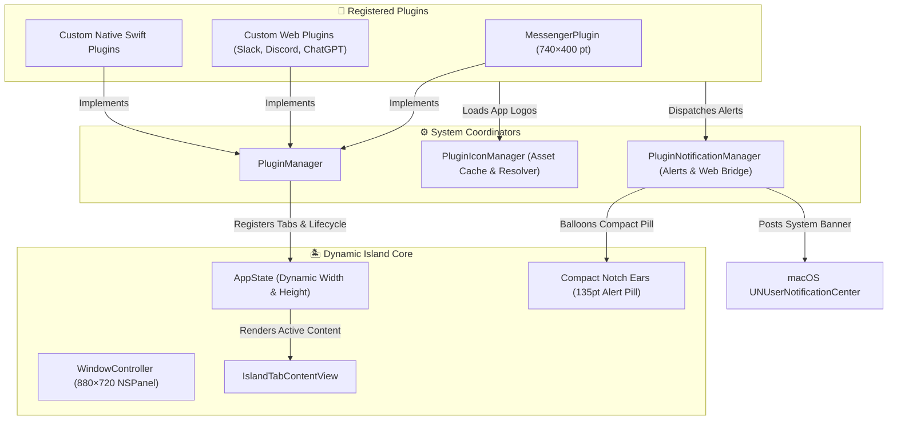

# 🧩 Dynamic Island Plugin & App Injection Guide

Welcome to the **Dynamic Island Plugin System** developer documentation. This guide details how to build, customize, and inject external applications (native Swift tools or web applications like Messenger, WhatsApp, Slack, Discord, ChatGPT) directly into the macOS notch.

---

## 📑 Table of Contents
1. [🌟 Architecture Overview](#1-architecture-overview)
2. [🧩 Core Plugin Protocol (`IslandPlugin`)](#2-core-plugin-protocol-islandplugin)
3. [🌐 Web App Injection Infrastructure (`IslandWebPlugin`)](#3-web-app-injection-infrastructure-islandwebplugin)
4. [🎨 Standardized UI Component Library](#4-standardized-ui-component-library)
5. [🖼️ Authentic App Icon Pipeline (`PluginIconManager`)](#5-authentic-app-icon-pipeline-pluginiconmanager)
6. [🔔 Notification Subsystem & Web Bridge (`PluginNotificationManager`)](#6-notification-subsystem--web-bridge-pluginnotificationmanager)
7. [📐 Dynamic Sizing Architecture (Large Cockpit Viewports)](#7-dynamic-sizing-architecture-large-cockpit-viewports)
8. [🚀 Step-by-Step Tutorial: Ingesting a New Web App](#8-step-by-step-tutorial-ingesting-a-new-web-app)
9. [🧪 Testing & Debugging Notifications](#9-testing--debugging-notifications)

---

## 1. 🌟 Architecture Overview

The Dynamic Island plugin architecture provides an extensible, modular host where apps can live at the top of the display:



### Key Principles
- **Standardized Componentry:** All plugins and tools share the same Liquid Glass aesthetic, typography, and button feedback.
- **Dynamic Adaptive Sizing:** Utility tabs (Media, Timer, Notes) stay compact (`560×170pt`), while rich integrated apps balloon smoothly into a full workspace (`740×400pt`).
- **Autonomous Notification Pipeline:** Web notifications and page title flashing are intercepted automatically and manifested as in-notch live alert pills.
- **Zero Tab Duplication:** The Universal Tab Content Rule guarantees all five opened island layout shells reuse the exact same plugin content view seamlessly.

---

## 2. 🧩 Core Plugin Protocol (`IslandPlugin`)

Located in [`Sources/DynamicIsland/Plugins/IslandPlugin.swift`](../Sources/DynamicIsland/Plugins/IslandPlugin.swift), any app or custom feature implements `IslandPlugin`:

```swift
public protocol IslandPlugin: AnyObject, Identifiable {
    var id: String { get }                      // Unique reverse-DNS ID (e.g. "com.dynamicisland.plugin.messenger")
    var name: String { get }                    // Display name shown on tab pill (e.g. "Messenger")
    var icon: String { get }                    // SF Symbol fallback icon
    var subtitle: String { get }                // Short description of the plugin
    var author: String { get }                  // Author / Organization
    var version: String { get }                 // Semantic version string
    var capabilities: IslandPluginCapabilities { get } // Capability flags
    var isEnabled: Bool { get set }             // Persistent user toggle
    var preferredContentHeight: CGFloat { get } // Viewport height when expanded (defaults to 400pt for apps)
    var preferredIslandWidth: CGFloat? { get }  // Viewport width when expanded (defaults to 740pt for apps)
    var tabBadge: String? { get }               // Optional dynamic badge (e.g. "3" unread)
    
    // Lifecycle Hooks
    func onRegister()
    func onEnable()
    func onDisable()
    func onTabSelected()
    func onTabDeselected()
    
    // View Providers
    func makeContentView() -> AnyView
    func makeCompactAccessory() -> AnyView?
    func makeSettingsView() -> AnyView?
    func makeIconView(size: CGFloat) -> AnyView?
}
```

### Capabilities (`IslandPluginCapabilities`)
- `.variableHeight`: Supports dynamic, non-standard viewport height.
- `.compactAccessory`: Supplies a closed notch ear accessory (e.g., unread counter or audio status).
- `.customSettings`: Provides a dedicated card in **Preferences → Plugins**.
- `.deepLinking`: Can receive custom url schemes (`dynamicisland://plugin/<id>`).

---

## 3. 🌐 Web App Injection Infrastructure (`IslandWebPlugin`)

For web-based services (Facebook Messenger, WhatsApp Web, Slack, Discord, Notion, Linear, ChatGPT), Dynamic Island provides a specialized host located in [`Sources/DynamicIsland/Plugins/IslandWebPlugin.swift`](../Sources/DynamicIsland/Plugins/IslandWebPlugin.swift).

### Features
- **Persistent Non-Ephemeral Storage:** Stores cookies, `localStorage`, and session credentials in `WKWebsiteDataStore.default()` across app restarts.
- **Desktop Safari User-Agent:** Prevents mobile web redirection, requesting modern full-featured desktop web apps.
- **Dynamic Zoom Control:** Built-in interactive zooming (`setZoom()`, `zoomIn()`, `zoomOut()`) to scale chat interfaces.
- **Custom CSS/JS Injection:** Injects dark scrollbars and layout tweaks at document load.
- **External Link Routing:** Pop-up windows or external links (`target="_blank"`) open safely in the user's default browser (Safari, Chrome, Arc).

```swift
let config = IslandWebConfiguration(
    initialURL: URL(string: "https://www.messenger.com/")!,
    customUserAgent: "Mozilla/5.0 (Macintosh; Intel Mac OS X 10_15_7) AppleWebKit/605.1.15 (KHTML, like Gecko) Version/17.5 Safari/605.1.15",
    zoomFactor: 0.88,
    customCSS: "::-webkit-scrollbar { width: 4px; }",
    customJS: nil,
    allowsBackForwardNavigationGestures: true
)

let controller = IslandWebController(configuration: config)
```

---

## 4. 🎨 Standardized UI Component Library

Located in [`Sources/DynamicIsland/Views/Components/IslandComponents.swift`](../Sources/DynamicIsland/Views/Components/IslandComponents.swift), these components ensure visual parity across all built-in tabs and external plugins:

### 4.1 `IslandHeaderView`
Universal header for tool tabs and integrated apps with leading logo/title, live status badge, and trailing action buttons:
```swift
IslandHeaderView(
    iconView: AnyView(MessengerAppIconView(size: 18, withSquircle: true)),
    title: "Messenger",
    subtitle: "Ready to chat",
    statusBadge: "3 new",
    statusColor: .blue
) {
    HStack(spacing: 5) {
        IslandButton(nil, icon: "arrow.clockwise", variant: .ghost, size: .small) {
            controller.reload()
        }
        IslandButton(nil, icon: "arrow.up.right.square", variant: .secondary, size: .small) {
            controller.openInExternalBrowser()
        }
    }
}
```

### 4.2 `IslandCardView`
Continuous rounded rectangle container with translucent liquid glass backing and specular border:
```swift
IslandCardView(cornerRadius: 10) {
    IslandWebViewHost(controller: controller)
}
.frame(maxHeight: .infinity)
.padding(.horizontal, 6)
```

### 4.3 `IslandButton`
Tactile bouncy buttons with macOS spring physics:
- **Variants:** `.primary`, `.secondary`, `.ghost`, `.tinted(Color)`, `.danger`.
- **Sizes:** `.small`, `.regular`, `.large`.
```swift
IslandButton("Log Out", icon: "trash", variant: .danger, size: .small) {
    controller.clearCache()
}
```

### 4.4 `IslandSearchField` & `IslandEmptyStateView`
- `IslandSearchField(text: $query, placeholder: "Search conversations...")`
- `IslandEmptyStateView(icon: "wifi.slash", title: "No Connection", subtitle: "Reconnecting to server...")`

---

## 5. 🖼️ Authentic App Icon Pipeline (`PluginIconManager`)

Dynamic Island uses a standardized icon resolution pipeline in [`Sources/DynamicIsland/Plugins/PluginIconManager.swift`](../Sources/DynamicIsland/Plugins/PluginIconManager.swift). Plugins can supply official PNG logos directly without relying on generic vector shapes.

### Multi-Tier Discovery Hierarchy
When an icon is requested for `id`:
1. **In-Memory Cache:** Fast lookup in `NSCache<NSString, NSImage>`.
2. **Persistent User Cache:** `~/Library/Application Support/DynamicIsland/PluginIcons/<id>.png`.
3. **App Bundle Resources:** `DynamicIsland.app/Contents/Resources/PluginIcons/<id>.png`.
4. **Development Directory:** `Resources/PluginIcons/<id>.png`.
5. **Installed macOS Application:** Queries `NSWorkspace` for installed application icons (e.g. `/Applications/Slack.app`).
6. **Fallback View Provider:** Calls `plugin.makeIconView(size:)` or renders the SF Symbol.

### Packaging Bundled Icons
To bundle an authentic icon with the app:
1. Place a 512×512 PNG in `Resources/PluginIcons/<plugin_id>.png` (e.g. `Resources/PluginIcons/messenger.png`).
2. `./scripts/build_app.sh` automatically packages all icons into `Contents/Resources/PluginIcons/`.

### Remote Icon Downloading
```swift
PluginIconManager.shared.downloadAndCacheIcon(from: logoURL, for: "com.example.plugin") { image in
    print("Icon downloaded and cached!")
}
```

---

## 6. 🔔 Notification Subsystem & Web Bridge (`PluginNotificationManager`)

Located in [`Sources/DynamicIsland/Plugins/PluginNotificationManager.swift`](../Sources/DynamicIsland/Plugins/PluginNotificationManager.swift), this system intercepts and presents notifications across both compact notch and expanded states.

### 6.1 HTML5 Web Notification Bridge
Injected automatically at `.atDocumentStart` into `WKWebView`:
- **JavaScript Polyfill:** Hooks `window.Notification` and `Notification.requestPermission()`.
- When a web page executes `new Notification("Alice", { body: "Hey there!" })`, the bridge serializes the payload to native Swift via `WKScriptMessageHandler` (`islandNotification`).

### 6.2 Title Flashing Detection
Web apps frequently update the browser tab title instead of calling notifications (e.g., `(1) Alice: Hey there!`).
- `IslandWebController` observes `webView.title`.
- When the unread count increments (`count > oldCount`), it parses the sender and message preview and dispatches an alert.

### 6.3 In-Notch Live Alert Pill
When a notification arrives while the notch is closed:
1. Compact ear width smoothly balloons outward from `56pt` to `135pt` (`IslandSpring.expand`).
2. **Left Ear:** Displays the authentic app icon + author/sender name.
3. **Right Ear:** Displays the message preview snippet.
4. **Auditory Feedback:** Plays `SoundManager.shared.play(.notification)` ("Glass" or "Hero" chime).
5. **Tap-to-Chat:** Tapping the live alert pill dismisses the notification and expands Dynamic Island straight into that plugin's tab.
6. **Auto-Dismiss:** Banners gracefully collapse back to normal notch state after 4.5 seconds.

### 6.4 Native macOS System Notifications
Every notification is simultaneously registered with `UNUserNotificationCenter`. Clicking a macOS system notification banner automatically opens Dynamic Island to that specific plugin tab via `DynamicIslandApp.swift`.

### 6.5 Posting Custom Notifications
Any native or web plugin can dispatch notifications directly:
```swift
PluginNotificationManager.shared.post(
    pluginId: "com.dynamicisland.plugin.messenger",
    title: "Sarah Jenkins",
    body: "Are you free for lunch today?",
    subtitle: "Messenger",
    soundEnabled: true
)
```

---

## 7. 📐 Dynamic Sizing Architecture (Large Cockpit Viewports)

Dynamic Island provides context-sensitive morphing between lightweight system tools and large workspace applications:

| View Type | Island Width | Content Height | Total Expanded Height |
| :--- | :--- | :--- | :--- |
| **System Tools** (Media, Timer, Notes, Clipboard) | `560 pt` (`490pt` in Compact HUD) | `170 pt` | `~262 pt` |
| **Integrated Apps** (Messenger, Slack, ChatGPT) | **`740 pt`** (`660pt` in Compact HUD) | **`400 pt`** | **`~488 pt`** |

### Key Mechanics
- **NSPanel Headroom:** `DynamicIslandPanel` uses an **`880 × 720 pt`** canvas, accommodating large viewports and the secondary split drop shelf without clipping.
- **Open-Top Boundary Hit-Testing:** Transparent panel space passes clicks through to underlying macOS apps. Only coordinates inside `expandedWidth` and `totalExpandedHeight` receive mouse clicks.
- **Seamless Spring Morphing:** Switching between tabs animates both width and height fluidly via `IslandAnimations.widthAnimation` and `heightAnimation`.

---

## 8. 🚀 Step-by-Step Tutorial: Ingesting a New Web App

Here is how to add **WhatsApp Web** or **Slack** in under 5 minutes:

### Step 1: Create the Plugin Class
Create `Sources/DynamicIsland/Plugins/Builtin/WhatsAppPlugin.swift`:

```swift
import SwiftUI
import AppKit

public class WhatsAppPlugin: ObservableObject, IslandPlugin {
    public static let shared = WhatsAppPlugin()
    public static let pluginID = "com.dynamicisland.plugin.whatsapp"
    
    public let id: String = WhatsAppPlugin.pluginID
    public let name: String = "WhatsApp"
    public let icon: String = "message.fill"
    public let subtitle: String = "WhatsApp Web chat inside the notch"
    
    @Published public var isEnabled: Bool = true
    public var preferredContentHeight: CGFloat { 400.0 }
    public var preferredIslandWidth: CGFloat? { 740.0 }
    
    public var tabBadge: String? {
        webController.pageTitleUnreadCount > 0 ? "\(webController.pageTitleUnreadCount)" : nil
    }
    
    public private(set) var webController: IslandWebController!
    
    private init() {
        let config = IslandWebConfiguration(
            initialURL: URL(string: "https://web.whatsapp.com/")!,
            customUserAgent: "Mozilla/5.0 (Macintosh; Intel Mac OS X 10_15_7) AppleWebKit/605.1.15 (KHTML, like Gecko) Version/17.5 Safari/605.1.15",
            zoomFactor: 0.88,
            customCSS: "::-webkit-scrollbar { width: 4px; }",
            customJS: nil,
            allowsBackForwardNavigationGestures: true
        )
        self.webController = IslandWebController(configuration: config)
        
        // Connect notifications
        webController.onNotificationReceived = { [weak self] title, body, icon in
            guard let self = self, self.isEnabled else { return }
            PluginNotificationManager.shared.post(
                pluginId: self.id,
                title: title,
                body: body,
                subtitle: "WhatsApp"
            )
        }
    }
    
    public func makeContentView() -> AnyView {
        AnyView(
            VStack(spacing: 6) {
                IslandHeaderView(
                    iconView: PluginIconManager.shared.iconView(for: self, size: 18),
                    title: "WhatsApp",
                    subtitle: "Connected"
                )
                IslandCardView(cornerRadius: 10) {
                    IslandWebViewHost(controller: webController)
                }
                .frame(maxHeight: .infinity)
                .padding(.horizontal, 6)
            }
            .padding(.bottom, 6)
        )
    }
}
```

### Step 2: Register in `PluginManager.swift`
In `Sources/DynamicIsland/Plugins/PluginManager.swift`:
```swift
register(WhatsAppPlugin.shared)
```

### Step 3: Add Icon
Place `whatsapp.png` in `Resources/PluginIcons/whatsapp.png`.

### Step 4: Build & Launch
```bash
DEVELOPER_DIR=/Library/Developer/CommandLineTools ./scripts/build_app.sh && \
pkill -f DynamicIsland || true && \
open /Applications/DynamicIsland.app
```

---

## 9. 🧪 Testing & Debugging Notifications

### In-App Testing
Open **Preferences (`⌘,`) → Plugins → Messenger** and click **Test Notification**. The notch will immediately balloon open with the app logo, author name, and message preview.

### Command Line / External Testing
You can post test notifications from Terminal or external scripts via macOS `NSDistributedNotificationCenter`:

```bash
DEVELOPER_DIR=/Library/Developer/CommandLineTools xcrun swift -e '
import Foundation
let info: [String: Any] = [
    "title": "Sarah Jenkins",
    "body": "Hey! Testing the Dynamic Island notification banner!",
    "pluginId": "com.dynamicisland.plugin.messenger"
]
DistributedNotificationCenter.default().postNotificationName(
    NSNotification.Name("com.dynamicisland.pluginNotification"),
    object: nil,
    userInfo: info,
    deliverImmediately: true
)
'
```
