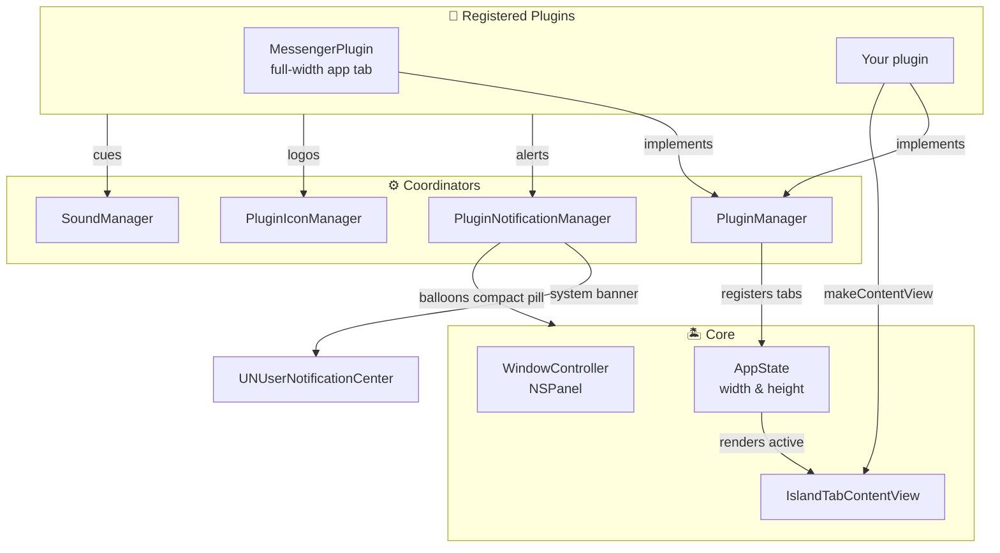

# 🧩 Plugin & App Injection Guide

How to build a plugin and inject an application — native or web — into the Dynamic
Island.

---

## 📑 Table of Contents

1. [Architecture Overview](#1-architecture-overview)
2. [The `IslandPlugin` Protocol](#2-the-islandplugin-protocol)
3. [Required Members You Cannot Skip](#3-required-members-you-cannot-skip)
4. [Web App Injection](#4-web-app-injection)
5. [The UI Component Library](#5-the-ui-component-library)
6. [The Icon Pipeline](#6-the-icon-pipeline)
7. [Per-Plugin Sound](#7-per-plugin-sound)
8. [Notifications](#8-notifications)
9. [Dynamic Sizing](#9-dynamic-sizing)
10. [Tutorial: Adding a Web App](#10-tutorial-adding-a-web-app)
11. [Testing a Plugin](#11-testing-a-plugin)

---

## 1. Architecture Overview



### Key principles

- **Standardized components.** Every plugin shares the same Liquid Glass aesthetic,
  typography, and button feedback.
- **Dynamic sizing.** Plugins declare their viewport; the island resizes to fit.
- **Automatic sound settings.** Registering a plugin produces working audio settings
  with zero UI code.
- **Zero tab duplication.** All shells render tab content through one shared view.

---

## 2. The `IslandPlugin` Protocol

Declared in `Sources/DynamicIsland/Plugins/IslandPlugin.swift`.

```swift
public protocol IslandPlugin: AnyObject, Identifiable {
    var id: String { get }                       // reverse-DNS, e.g. "com.dynamicisland.plugin.whatsapp"
    var name: String { get }                     // tab pill label
    var icon: String { get }                     // SF Symbol fallback

    var subtitle: String { get }                 // default ""
    var author: String { get }                   // default "Dynamic Island Community"
    var version: String { get }                  // default "1.0.0"
    var capabilities: IslandPluginCapabilities { get }   // default []
    var isEnabled: Bool { get set }              // user toggle

    var preferredContentHeight: CGFloat { get } // default 400
    var preferredIslandWidth: CGFloat? { get }   // default 740
    var tabBadge: String? { get }                // default nil

    var defaultSoundProfile: IslandPluginSoundProfile { get }  // default .standard

    func onRegister()
    func onEnable()
    func onDisable()
    func onTabSelected()
    func onTabDeselected()

    @ViewBuilder func makeContentView() -> AnyView

    func makeCompactAccessory() -> AnyView?      // default nil — LEFT ear, may carry text
    func compactStatusToken() -> RightEarToken?  // default nil — RIGHT ear, graphical only
    func makeSettingsView() -> AnyView?          // default nil
    func makeIconView(size: CGFloat) -> AnyView? // default nil
}
```

### Capabilities

| Flag | Meaning |
| :--- | :--- |
| `.variableHeight` | Supports a custom expanded height |
| `.compactAccessory` | Supplies a closed-notch accessory |
| `.customSettings` | Provides a card in **Preferences → Plugins** |
| `.deepLinking` | Accepts `dynamicisland://plugin/<id>` |

### Lifecycle

`onRegister` / `onEnable` / `onDisable` are called by the registry. `onTabSelected`
and `onTabDeselected` are dispatched centrally from `AppState.activeTab.didSet`, so
**no assignment site can forget them** — including deep links, the timer path, and
notification taps.

---

## 3. Required Members You Cannot Skip

Two members are compile-time obligations rather than suggestions:

**`defaultSoundProfile`** — declaring it on the protocol means a plugin cannot be
registered without stating which cues it uses. The Settings UI generates controls
from the plugin registry, so registering a plugin with working audio settings
requires **no UI code at all**.

**`compactStatusToken()`** — returns a `RightEarToken`, never a view. Because the
right ear accepts only a closed token enum where no case except `.battery` can carry
a string, a plugin **structurally cannot** put text there. If your plugin needs
readable text in the notch, use `makeCompactAccessory()` for the left ear.

> [!TIP]
> These are level-2 enforcement in practice: omitting either one fails
> compilation. See [`../AGENTS.md`](../AGENTS.md) §1.

---

## 4. Web App Injection

`IslandWebPlugin.swift` provides a reusable `WKWebView` host.

### `IslandWebConfiguration`

```swift
public struct IslandWebConfiguration {
    public var initialURL: URL
    public var customUserAgent: String   // desktop Safari UA by default
    public var zoomFactor: Double        // default 0.88
    public var customCSS: String?
    public var customJS: String?
    public var allowsBackForwardNavigationGestures: Bool  // default true
}
```

### `IslandWebController`

`NSObject`, `ObservableObject`, `WKNavigationDelegate`, `WKUIDelegate`, and
`WKScriptMessageHandler`.

| Member | Purpose |
| :--- | :--- |
| `webView` | The managed `WKWebView` |
| `title`, `isLoading`, `currentURL`, `estimatedProgress` | Observed page state |
| `canGoBack` / `canGoForward` | Navigation availability |
| `pageTitleUnreadCount: Int` | Unread count parsed from the page title |
| `onNotificationReceived` | `(title, body, icon) -> Void` — HTML5 notifications |
| `onTitleNotificationTriggered` | `(count, rawTitle) -> Void` — unread increments |
| `zoomIn()` / `zoomOut()` / `setZoom(_:)` / `resetZoom()` | Interactive zoom |

### What it handles for you

- **Persistent storage** via `WKWebsiteDataStore.default()` — cookies and
  `localStorage` survive relaunch, so sessions stay logged in.
- **Desktop user agent** so web apps serve their desktop layout instead of
  redirecting to mobile.
- **External link routing** — `target="_blank"` and pop-ups open in the user's
  default browser rather than inside the notch.
- **Zoom controls** for chat interfaces that are cramped in a narrow viewport.

### Rendering it

```swift
IslandCardView(cornerRadius: 10) {
    IslandWebViewHost(controller: webController)
}
.frame(maxHeight: .infinity)
```

---

## 5. The UI Component Library

`Views/Components/IslandComponents.swift` — shared by built-in tabs and plugins so
everything looks and feels identical.

### `IslandHeaderView`

Leading icon/logo, title, subtitle, optional status badge, and trailing actions.

```swift
IslandHeaderView(
    iconView: PluginIconManager.shared.iconView(for: self, size: 18),
    title: "WhatsApp",
    subtitle: "Connected",
    statusBadge: "3 new",
    statusColor: .blue
) {
    HStack(spacing: 5) {
        IslandButton(nil, icon: "arrow.clockwise", variant: .ghost, size: .small) {
            webController.reload()
        }
    }
}
```

### `IslandCardView`

The standard container: `Color.white.opacity(0.06)` with a continuous corner radius
and a specular border.

```swift
IslandCardView(cornerRadius: 10) { /* content */ }
```

### `IslandButton`

```swift
IslandButton("Log Out", icon: "trash", variant: .danger, size: .small) {
    webController.clearCache()
}
```

- **Variants:** `.primary`, `.secondary`, `.ghost`, `.tinted(Color)`, `.danger`
- **Sizes:** `.small`, `.regular`, `.large`

### `IslandSearchField` & `IslandEmptyStateView`

```swift
IslandSearchField(text: $query, placeholder: "Search conversations...")

IslandEmptyStateView(
    icon: "wifi.slash",
    title: "No Connection",
    subtitle: "Reconnecting to server..."
)
```

Also available: `IslandDivider`.

---

## 6. The Icon Pipeline

`PluginIconManager` resolves authentic app logos through a multi-tier hierarchy, so
plugins usually need no icon work at all.

| # | Tier | Location |
| :--- | :--- | :--- |
| 1 | In-memory cache | `NSCache<NSString, NSImage>` |
| 2 | Persistent user cache | `~/Library/Application Support/DynamicIsland/PluginIcons/<key>.png` |
| 3 | App bundle resources | `DynamicIsland.app/Contents/Resources/PluginIcons/<key>.png` |
| 4 | Development directory | `Resources/PluginIcons/<key>.png` |
| 5 | Installed macOS app | `NSWorkspace` lookup by bundle id |
| 6 | Fallback | `makeIconView(size:)`, else the SF Symbol |

Each tier is tried against several **candidate keys** derived from the plugin id:
the full id, its lowercase form, the last dot-separated component, and that
component lowercased. So `com.dynamicisland.plugin.messenger` will also match
`messenger.png` — which is why the bundled file is named `messenger.png` rather than
the full reverse-DNS id.

### Bundling an icon

1. Place a 512×512 PNG at `Resources/PluginIcons/<name>.png`.
2. `./scripts/build_app.sh` copies everything in that directory into
   `Contents/Resources/PluginIcons/`.

### Downloading one at runtime

```swift
PluginIconManager.shared.downloadAndCacheIcon(from: logoURL, for: plugin.id) { image in
    // cached to disk and memory
}
```

### Using it

```swift
PluginIconManager.shared.iconView(for: self, size: 18)   // for a plugin
PluginIconManager.shared.iconView(for: .messenger, size: 18)  // for a tab
```

---

## 7. Per-Plugin Sound

Every plugin is sound-configurable with no extra UI code, because the Settings pane
iterates the registry and builds controls from `IslandPluginSoundEvent.allCases`.

### Declaring defaults

```swift
public var defaultSoundProfile: IslandPluginSoundProfile {
    IslandPluginSoundProfile(
        isEnabled: true,
        volume: 0.9,
        alertCue: .ping,
        interactionCue: .pop
    )
}
```

### Playing a cue

```swift
SoundManager.shared.playPluginCue(.alert, pluginId: plugin.id)
SoundManager.shared.playPluginCue(.interaction, pluginId: plugin.id)
```

> [!IMPORTANT]
> **Always go through `playPluginCue(_:pluginId:)`.** It is the sole entry point that
> honours the global master switch, the per-plugin mute, and
> `globalVolume × pluginVolume`. Never call `NSSound` directly for plugin feedback —
> that bypasses every user preference.

The `pluginId` is required rather than inferred so notification audio is always
attributed to the plugin that raised it.

### Resolution and overrides

`soundProfile(forPlugin:)` is the single resolution point: an override for the id
wins, otherwise the plugin's `defaultSoundProfile` is used. Overrides are stored
**sparsely**, so shipping a new plugin — or a new default cue — needs no migration.

- `updatePluginSound(_:_:)` and `resetPluginSound(_:)` are the only mutators.
- `IslandSoundCue` is the curated cue set (`pop`, `tink`, `ping`, `glass`, `hero`,
  …), each with a display name and an SF Symbol for the picker.

Alerts route here from `PluginNotificationManager`; interactions route from
`AppState.activeTab.didSet`, so a plugin's cue plays on tab selection even if the
user disabled the generic tab-switch sound.

---

## 8. Notifications

`PluginNotificationManager` is the shared pipeline for both web and native plugins.

### Dispatching

```swift
PluginNotificationManager.shared.post(
    pluginId: "com.dynamicisland.plugin.whatsapp",
    title: "Sarah",
    body: "Are you free for lunch today?",
    subtitle: "WhatsApp",
    soundEnabled: true
)
```

### What happens

1. The plugin's configured **alert cue** plays via `playPluginCue(.alert, pluginId:)`.
2. The in-notch live alert appears (below).
3. A native macOS notification is posted via `UNUserNotificationCenter`. Clicking
   that banner routes straight to the plugin's tab.

### The in-notch alert pill

While the island is closed, an alert shows the app icon and sender on the **left**
ear and the sender's **icon only** on the **right** ear — never the message body,
per the right-ear contract. It auto-dismisses after **4.5 seconds**, and tapping it
opens the island directly into that plugin's tab.

> [!NOTE]
> The closed notch is a fixed-size window, so the alert does not balloon it. See
> [`ARCHITECTURE.md`](ARCHITECTURE.md) §3.

### The HTML5 web notification bridge

`IslandWebController` injects a polyfill at `.atDocumentStart` that hooks
`window.Notification` and `Notification.requestPermission()`. A page calling
`new Notification(title, options)` is serialized across
`WKScriptMessageHandler` (`islandNotification`) into native Swift and dispatched
through the same pipeline.

### Title-flashing detection

Chat apps often update the tab title instead of firing a notification — e.g.
`(3) Alice: Hey there!`. `IslandWebController` observes `webView.title`, and when the
unread count increments it parses the sender and message and dispatches an alert.
Expose the result through `tabBadge` and `compactStatusToken()` to surface it in the
tab pill and the closed notch.

### External triggering

`PluginNotificationManager` listens on the distributed notification
`com.dynamicisland.pluginNotification`, so other tools and scripts can raise
notifications too:

```bash
xcrun swift -e '
import Foundation
let info: [String: Any] = [
    "title": "Sarah Jenkins",
    "body": "Hey! Testing the Dynamic Island notification banner!",
    "pluginId": "com.dynamicisland.plugin.messenger"
]
DistributedNotificationCenter.default().postNotificationName(
    NSNotification.Name("com.dynamicisland.pluginNotification"),
    object: nil, userInfo: info, deliverImmediately: true
)
'
```

---

## 9. Dynamic Sizing

Your plugin's viewport is declared, not hard-coded:

```swift
public var preferredContentHeight: CGFloat { 400.0 }   // integrated apps
public var preferredIslandWidth: CGFloat? { 740.0 }     // integrated apps
```

Both axes morph with spring physics when switching between tool and app tabs. The
panel is sized to accommodate the largest of these — see
[`ARCHITECTURE.md`](ARCHITECTURE.md) §3 for the full geometry.

---

## 10. Tutorial: Adding a Web App

Adding WhatsApp Web takes about five minutes.

### Step 1 — Create the plugin

`Sources/DynamicIsland/Plugins/Builtin/WhatsAppPlugin.swift`:

```swift
import SwiftUI
import AppKit

public class WhatsAppPlugin: ObservableObject, IslandPlugin {
    public static let shared = WhatsAppPlugin()
    public static let pluginID = "com.dynamicisland.plugin.whatsapp"

    public let id: String = WhatsAppPlugin.pluginID
    public let name: String = "WhatsApp"
    public let icon: String = "message.fill"
    public let subtitle: String = "WhatsApp Web chat inside the notch"

    @Published public var isEnabled: Bool = true

    public var preferredContentHeight: CGFloat { 400.0 }
    public var preferredIslandWidth: CGFloat? { 740.0 }

    public var tabBadge: String? {
        webController.pageTitleUnreadCount > 0
            ? "\(webController.pageTitleUnreadCount)" : nil
    }

    /// Readable text belongs on the LEFT ear, so the unread count goes here.
    public func makeCompactAccessory() -> AnyView? {
        guard webController.pageTitleUnreadCount > 0 else { return nil }
        return AnyView(
            HStack(spacing: 3) {
                Image(systemName: icon).font(IslandFont.iconMicro)
                Text("\(webController.pageTitleUnreadCount)").font(IslandFont.metricNumeric)
            }
        )
    }

    /// The right ear takes only tokens — structurally incapable of carrying text.
    public func compactStatusToken() -> RightEarToken? {
        guard webController.pageTitleUnreadCount > 0 else { return nil }
        return .pluginIcon(systemName: icon)
    }

    public private(set) var webController: IslandWebController!

    private init() {
        let config = IslandWebConfiguration(
            initialURL: URL(string: "https://web.whatsapp.com/")!,
            zoomFactor: 0.88,
            customCSS: "::-webkit-scrollbar { width: 4px; }"
        )
        self.webController = IslandWebController(configuration: config)

        webController.onNotificationReceived = { [weak self] title, body, _ in
            guard let self, self.isEnabled else { return }
            PluginNotificationManager.shared.post(
                pluginId: self.id,
                title: title,
                body: body,
                subtitle: "WhatsApp"
            )
        }
    }

    public func makeContentView() -> AnyView {
        AnyView(
            VStack(spacing: 6) {
                IslandHeaderView(
                    iconView: PluginIconManager.shared.iconView(for: self, size: 18),
                    title: "WhatsApp",
                    subtitle: "Connected"
                ) {
                    HStack(spacing: 5) {
                        IslandButton(nil, icon: "plus", variant: .ghost, size: .small) {
                            self.webController.zoomIn()
                        }
                        IslandButton(nil, icon: "minus", variant: .ghost, size: .small) {
                            self.webController.zoomOut()
                        }
                    }
                }
                IslandCardView(cornerRadius: 10) {
                    IslandWebViewHost(controller: webController)
                }
                .frame(maxHeight: .infinity)
                .padding(.horizontal, 6)
            }
            .padding(.bottom, 6)
        )
    }
}
```

### Step 2 — Register it

In `Sources/DynamicIsland/Plugins/PluginManager.swift`:

```swift
register(plugin: WhatsAppPlugin.shared)
```

### Step 3 — Add an icon

Place `whatsapp.png` (512×512) at `Resources/PluginIcons/whatsapp.png`. The candidate
key `whatsapp` matches the last component of the plugin id, so no other wiring is
needed.

### Step 4 — Build and launch

```bash
DEVELOPER_DIR=/Library/Developer/CommandLineTools ./scripts/build_app.sh && \
pkill -f DynamicIsland || true && \
open /Applications/DynamicIsland.app
```

---

## 11. Testing a Plugin

**In-app** — **Preferences → Plugins → your plugin → Test Notification**. The notch
shows the alert pill immediately.

**From Terminal** — post a distributed notification (see §8).

**Checklist for a new plugin:**

- [ ] Compiles without overriding `defaultSoundProfile` or `compactStatusToken()`.
- [ ] The tab pill appears and reorders with the user's custom order.
- [ ] `makeContentView()` fills the declared viewport and the island resizes smoothly.
- [ ] `tabBadge` shows an unread count when there is one.
- [ ] `compactStatusToken()` shows an icon in the right ear — and no text appears.
- [ ] Sound settings appear under **Preferences → Sound Effects** with no extra code.
- [ ] A test notification shows the alert pill and plays the plugin's alert cue.
- [ ] The web session survives a relaunch (if web-based).
